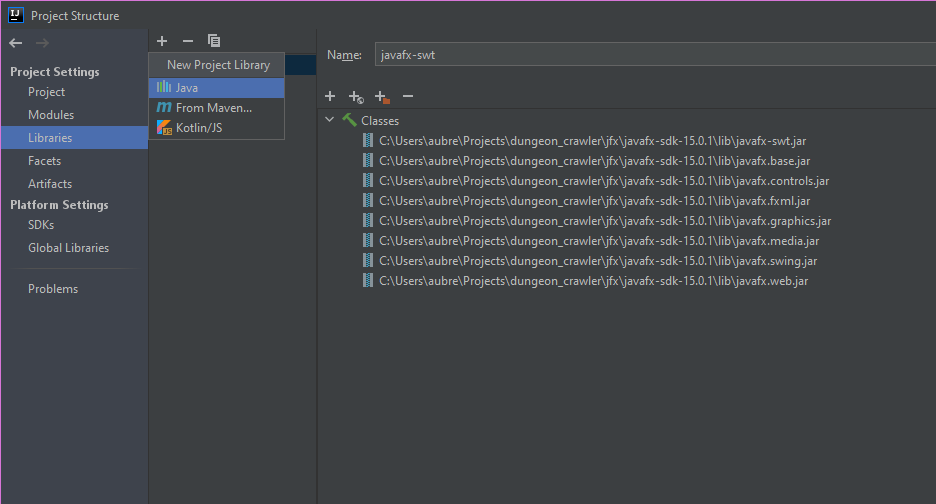
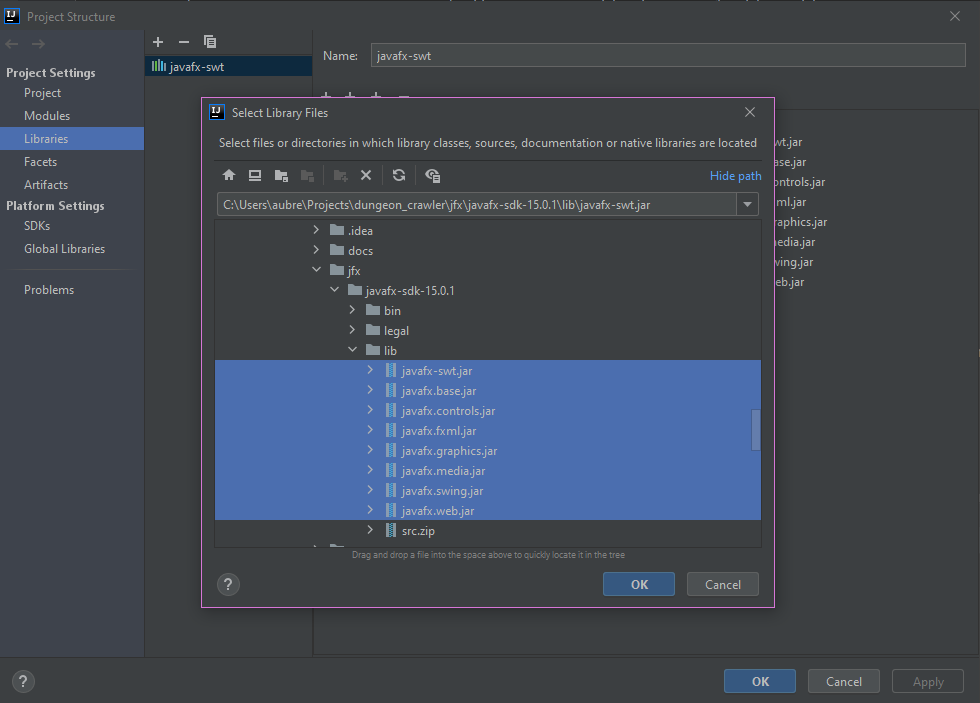

# dungeon_crawler

Dungeon crawler group project for CS 2340, Georgia Institute of Technology

## Setup

1. Download apache-maven-3.6.3-bin.zip from https://maven.apache.org/download.cgi


2. Extract the downloaded folder.


3. Create a new folder in your C drive called `.m2`

4. Inside `.m2`, paste the contents of the extracted folder (with folders bin, boot, conf, ...)

5. Make sure you have Java JDK12 installed https://www.oracle.com/java/technologies/javase/jdk12-archive-downloads.html

    Also make sure it's added to IntelliJ IDEA as an SDK (File -> Project Structure -> SDKs)

6. Add `C:\Program Files\.m2\bin` to your PATH

7. After restarting your terminal windows, you should be able to type `mvn -v`

    ```
    $ mvn -v
    Apache Maven 3.6.3 (cecedd343002696d0abb50b32b541b8a6ba2883f)
    Maven home: /mnt/c/.m2
    Java version: 11.0.9.1, vendor: Ubuntu, runtime: /usr/lib/jvm/java-11-openjdk-amd64
    Default locale: en, platform encoding: UTF-8
    OS name: "linux", version: "4.19.104-microsoft-standard", arch: "amd64", family: "unix"```
   
8. For your convenience, the Windows version of JavaFX (not bundled with Java distro) has been bundled with this
  repository in `jfx/javafx-sdk-15.0.1` so you do **not** need to redownload this. Go to File -> Project Structure ->
   Libraries and add a Java library.
   
   

9. Navigate to the following folder and select the following zip files. Click OK, and OK, to close out of the windows.

    

10. Now try to run the app. You should see a new window open.

    