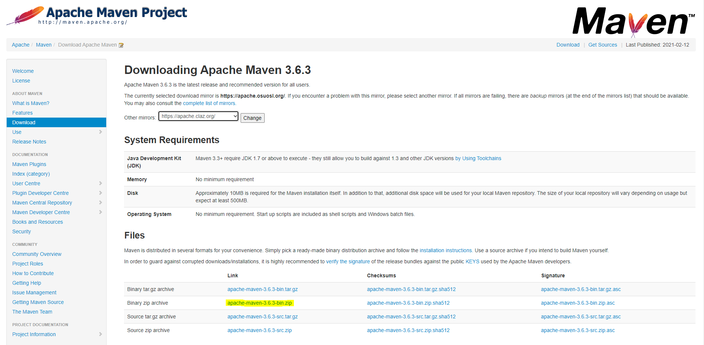
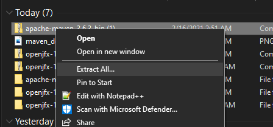
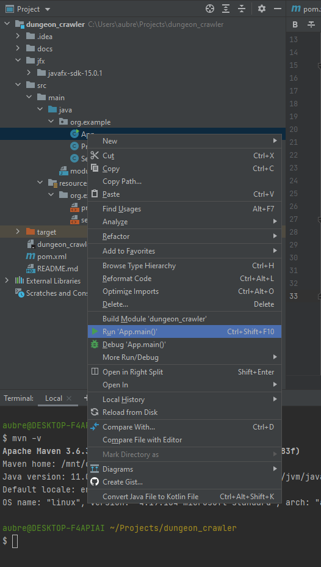
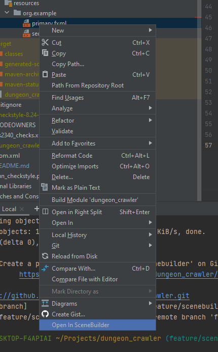

# dungeon_crawler
[](https://dev.azure.com/ayan46/dungeon_crawler/_build/latest?definitionId=1&branchName=master)

Dungeon crawler group project for CS 2340, Georgia Institute of Technology

## Setup

1. Download apache-maven-3.6.3-bin.zip from https://maven.apache.org/download.cgi



2. Extract the downloaded folder.



3. Create a new folder in your C drive called `.m2`

4. Inside `.m2`, paste the contents of the extracted folder (with folders bin, boot, conf, ...)

5. Make sure you have Java JDK12 installed https://www.oracle.com/java/technologies/javase/jdk12-archive-downloads.html

    Also make sure it's added to IntelliJ IDEA as an SDK (File -> Project Structure -> SDKs)

6. Add `C:\Program Files\.m2\bin` to your PATH

7. After restarting your terminal windows, you should be able to type `mvn -v`

    ```
    $ mvn -v
    Apache Maven 3.6.3 (cecedd343002696d0abb50b32b541b8a6ba2883f)
    Maven home: /mnt/c/.m2
    Java version: 11.0.9.1, vendor: Ubuntu, runtime: /usr/lib/jvm/java-11-openjdk-amd64
    Default locale: en, platform encoding: UTF-8
    OS name: "linux", version: "4.19.104-microsoft-standard", arch: "amd64", family: "unix"```
   

8. Now try to run the app. You should see a new window open.

    

9. Lastly, we need to setup SceneBuilder. First, download the appropriate installer for SceneBuilder (15.0.1) 
    https://gluonhq.com/products/scene-builder/#download
    
    Run the installer

10. Go to File -> Settings -> Languages & Frameworks -> JavaFX. Use the following path for SceneBuilder (which is the
    default install location) on Windows: `C:\Program Files\SceneBuilder\SceneBuilder.exe`.
    
    Hit apply and leave the settings window.

11. Right click on any fxml file and select "Open in SceneBuilder".

    

    You should see the SceneBuilder application pop up.

12. Provision a GCP project (https://console.cloud.google.com/)

    Note that a project has already been provisioned for this group - we only need one GCP instance to work off of.

13. Enable the [GMail API](https://developers.google.com/gmail/api).

14. Go to the following link (project-specific) https://console.cloud.google.com/apis/credentials/consent?project=<YOUR_PROJECT_HERE>

    Enter the requisite information and submit the OAuth consent screen. When this is done and you can view the consent
    overview, add a test user, and make that the source email which will be used to send emails for this application.
    In our case, this was turbulentsouls@gmail.com.

15. Go to the following link (project-specific) https://console.cloud.google.com/apis/credentials?project=<YOUR_PROJECT_HERE>

    Create credentials -> OAuth Client ID -> Desktop Application Type (give it a name).
    Finally, a screen will be displayed providing the `client id` and `client secret`.
    Record them as the respective environment variables `GCP_CLIENT_ID` and `GCP_CLIENT_SECRET`.
    
16. Download an API client. My client of choice is [Insomnia](https://insomnia.rest/)

17. Create a new GET request to `https://accounts.google.com/o/oauth2/v2/auth`. (Do not submit it yet)

    Add the following queries:

    ```
    client_id=<the client id you recorded earlier>
    response_type=code
    scope=https://www.googleapis.com/auth/gmail.send
    redirect_uri=http://localhost
    access_type=offline
    ```
    
    Insomnia should show you a preview of the final GET request.

    `https://accounts.google.com/o/oauth2/v2/auth?client_id=<CLIENT_ID>&response_type=code&scope=https%3A%2F%2Fwww.googleapis.com%2Fauth%2Fgmail.send&redirect_uri=http%3A%2F%2Flocalhost&access_type=offline`

    Copy this url, and paste it in a browser like Google Chrome.

    A permissions prompt will appear asking you to log into a google account. Make sure you are able to sign into the
    application email (which you will need to enable permissions for the API to send emails on its behalf).
    If you see some kind of authorization error, you did not properly add the email to your test users in step 14.
    
    You will see a few redirects and eventually a blank screen
    (localhost). Inside the final url in your browser's address bar, you'll see `code=<something>`.
    
    Save that code somewhere. It's not needed for this application but it's needed for the next step.

18. Create a new POST request to `https://www.googleapis.com/oauth2/v4/token`. (Do not submit it yet)

    Add the following request body:

    ```json
    {
        "code": "the code from step 17",
        "client_id": "the client id from step 15",
        "client_secret": "the client secret from step 15",
        "grant_type": "authorization_code",
        "redirect_uri": "http://localhost"
    }
    ```
    
    Submit the POST request in your API client. You should see the following response:

    ```json
    {
        "access_token": "<redacted>",
        "expires_in": 3599,
        "refresh_token": "<redacted>",
        "scope": "https://www.googleapis.com/auth/gmail.send",
        "token_type": "Bearer"
    }
    ```
    
    Record `access_token` and `refresh_token` as respective environment variables `GCP_ACCESS_TOKEN` and `GCP_REFRESH_TOKEN`.
    You will see that these are used in the `EmailService`.
    
    Email sending should be functional at this point.
    
    Also, this was not explicitly mentioned anywhere, but the environment variable `GOOGLE_EMAIL` is also needed.
